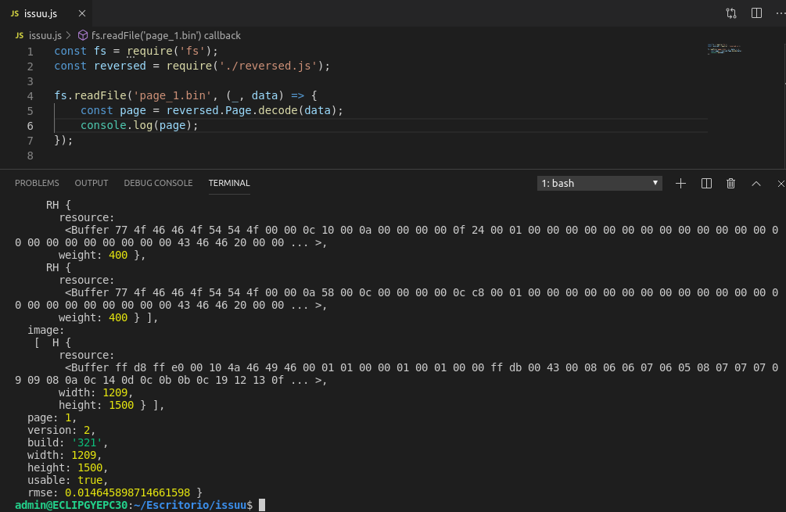

# issuu
reverse engineering of issuu.com display tecnologies. working as of 12/09/19.

# background
I needed to get data from this page [https://www.vistazo.com/proyectos-especiales/500-empresas-2018](https://www.vistazo.com/proyectos-especiales/500-empresas-2018)

but it was restricted. I started studying the site and found they use a binary encoded in protobuf. This repo is an example of how to extract the data.

